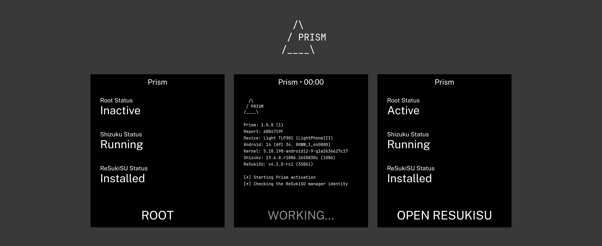

> [!CAUTION]
> By running Prism, you acknowledge the risks and accept sole responsibility for any device damage, instability or data loss.
>
> Prism only supports the Light Phone III (`TLP301`) running firmware `00WW_1_440000`.
>
> It does not unlock the bootloader, flash a partition or erase your data. Root remains active until the phone restarts.

## About

Root for the Light Phone III. It uses CVE-2024-46740 and integrates with ReSukiSU.

## Installation

The latest `.apk` file is available in [releases](https://github.com/vandamd/prism/releases/latest).

## Getting started

1. Install and open Prism.
2. Install Shizuku when prompted.
3. Start Shizuku. The wireless debugging method is preferred.
4. Return to Prism and install ReSukiSU.
5. Allow Prism access when Shizuku asks.
6. Tap **Root** and wait for Prism to return automatically.

## Notes

- ReSukiSU may open whilst working. Do not return to Prism manually. Wait for Prism to come back by itself and confirm that **Root Status** shows **Active**.
- A prompt to grant notification permission may appear, but it is not required.
- An unsuccessful attempt may restart the phone automatically. This is a normal safety measure and does not erase your data. Start Shizuku again after the phone boots, then retry. A successful activation does not restart the phone.
- For Shizuku's wireless pairing `adb shell cmd statusbar expand-notifications` may be useful.

## Collecting failure logs

After an unsuccessful attempt or safety restart, logs can be obtained with:

```sh
adb pull /data/local/tmp/prism-controller.trace .
adb exec-out run-as com.vandam.prism cat files/direct.result > direct.result
adb exec-out run-as com.vandam.prism cat files/chain.progress > chain.progress
adb exec-out run-as com.vandam.prism cat files/app-bridge.failure > app-bridge.failure
```

`app-bridge.failure` may be empty when no bridge failure was recorded.

## Building

```
./gradlew :app:assembleDebug
```

## Credits

- [Shizuku](https://github.com/RikkaApps/Shizuku) by RikkaApps for privileged Android API access.
- [ReSukiSU](https://github.com/ReSukiSU/ReSukiSU) for the KernelSU-based root implementation.
- [Root My Pixel](https://github.com/alex193a/Root-My-Pixel) for the inspiration.
